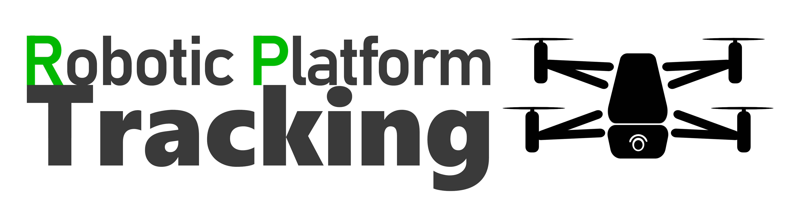

<p align="center">
	
</p>

RP Tracking is an easy-to-use system for tracking mobile robots and drones in indoor lab environments. It uses time-of-flight based sensors, like LiDAR, to detect moving objects in point clouds. Contrary to off-the-shelf systems, this work can be used with any time-of-flight sensor that captures accurate data and can be integrated into the ROS 1 environment. Furthermore, it supports multiple sensors to increase accuracy and area size.

## Example

<p align="center">
	
</p>

---

## Usage

1. Clone this repository into your *catkin* workspace.

2. Install missing ROS packages (probably only *jsk_recognition_msgs*).

3. Build the software using *catkin_make*.

4. Source the current worksapce using *source devel/setup.bash'*.

5. Execute the following command. Replace *MODEL_PATH* with a path to a model file (e.g. "CATKIN_WS/src/rp_tracking/rp_tracking/rp_tracking/models/tello_cage.model", replace *CATKIN_WS* with the path to your workspace) and set *TOPIC* to the name of the topic, where the input point cloud is published at.

   ```bash
   roslaunch rp_tracking rp_tracking.launch _model:=MODEL_PATH _input_cloud:=/TOPIC
   ```

For more detailed information on how to use RP Tracking, please take a look at the [documentation](docs/readme.md). To test this software, a [demo](docs/demo.md) is made available.

## Citation

Please cite the following paper in your publications if you use Deploy-to-Grading in your research:

```bibtex
@inproceedings{RP_Tracking2025,
    author    = "Kirsch, André and Rexilius, Jan",
    title     = "An Easy-to-Use System for Ground Truth Tracking Data Acquisition of Robotic Platforms using Time-of-Flight Sensors in Lab Environments",
    year      = 2025,
    booktitle = "14th International Conference on Pattern Recognition Applications and Methods (ICPRAM)",
    doi       = "TODO"
}
```

---

## License

This [work](https://github.com/IoT-Lab-Minden/rp_tracking) by [André Kirsch](https://github.com/AKirsch1) and [Jan Rexilius](https://github.com/jrx-hsbi) is licensed under [MIT](LICENSE.md).
