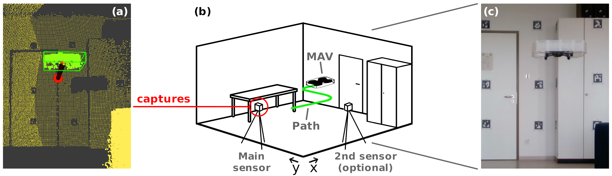

# Robotic platform tracking

<p align="center">
    
</p>

### 1. Sensor setup

To use the data provided by a sensor, it needs to be published using a ROS topic of the type *sensor_msgs/PointCloud2*. Due to the different types of sensors, we do not provide an implementation for this. But for many sensor types, an implementation can be found online.

To use multiple sensors, please take a look at the [multi sensor documentation](multi_sensor_support.md). When you are using sensors, that only provide partial data, please follow the [partial data documentation](partial_data_support.md).

### 2. Model definition

In the next step, the model needs to be defined. Typically, you can use the dimensions (length, width, height) specified in the documentation of the robot. These values need to be stored in a text file as shown in the following listing. The values are the length, width, and height, respectively. If you run the *robot_detection* directly, you might also specify the dimensions as parameters.

```
0.2
0.2
0.05
```

If you are only using a single sensor, it might be necessary to reduce either the length or width for successful tracking, as in this case, it is harder to capture the depth of the tracked object.

### 3. Robotic platform tracking

When the sensor input has been setup and a model was defined, the robotic platform tracking can be started using the command in the next listing:

```bash
roslaunch rp_tracking rp_tracking.launch model:=MODEL_PATH input_cloud:=/point_cloud_in_topic ground_height:=0.0 downsample:=false
```

Please replace *MODEL_PATH* with the actual path to the model file. Instead of using your own model, you may also use one of the provided model files stored in *rp_tracking/models*. Also replace the the value for the *input_cloud* with the topic name of your point cloud publisher. For ground removal, the estimated ground height can be set using the *ground_height* parameter. If you detect any performance issues, downsampling of the input cloud can be activated using the *downsample* parameter. This balances the point density over the whole point cloud. Detected poses are published on the */pose_detect* topic with the *geometry_msgs::PoseStamped* message type.

